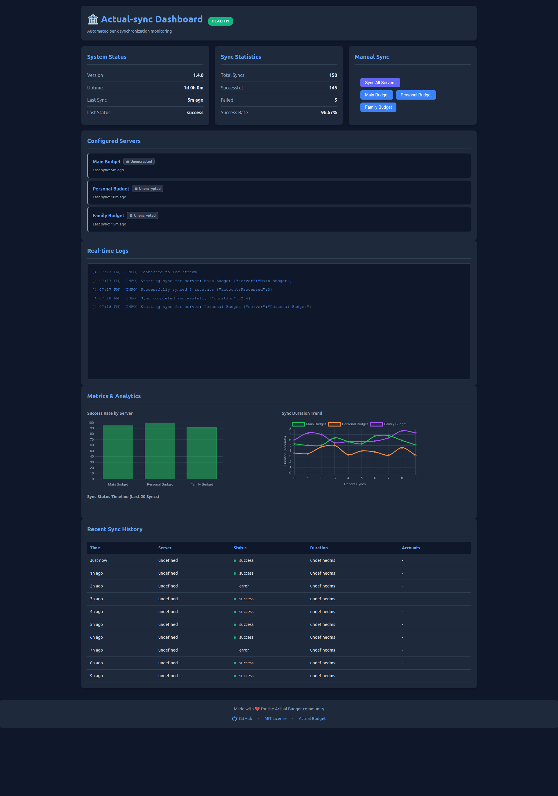
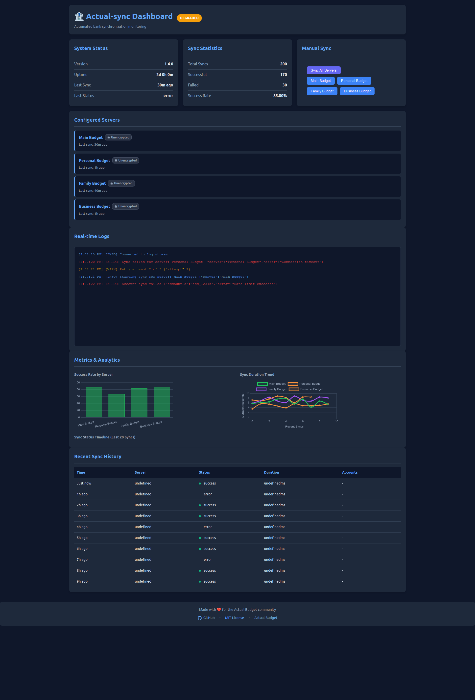
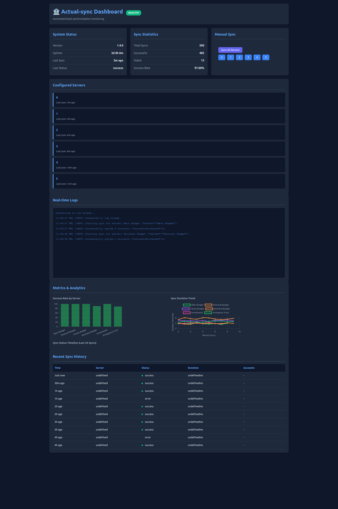

# 🏦 Actual-sync

> Automated bank synchronization service for Actual Budget with multi-server support, health monitoring, and comprehensive error handling


---

## 📚 Table of Contents

- [About](#-about)
- [Features](#-features)
- [Quick Start](#-quick-start)
- [Installation](#-installation)
- [Configuration](#%EF%B8%8F-configuration)
- [Usage](#-usage)
- [Docker Deployment](#-docker-deployment)
- [Monitoring & Observability](#-monitoring--observability)
- [Notifications](#-notifications)
- [Testing](#-testing)
- [Security](#-security)
- [Troubleshooting](#-troubleshooting)
- [Documentation](#-documentation)
- [Roadmap](#%EF%B8%8F-roadmap)
- [Contributing](#-contributing)
- [License](#-license)
- [Acknowledgments](#-acknowledgments)

---

## 🧠 About

**Actual-sync** is a production-ready Node.js service that automates bank transaction synchronization for [Actual Budget](https://actualbudget.org) servers. Built for reliability and ease of use, it eliminates the need for manual sync operations and ensures your financial data stays current across multiple budget instances.

### What It Does

- **Automates** scheduled bank synchronization using cron expressions
- **Manages** multiple Actual Budget servers from a single service
- **Handles** network failures, rate limits, and API errors gracefully
- **Monitors** sync health with HTTP endpoints and Prometheus metrics
- **Notifies** you of failures via Telegram, email, Slack, Discord, or Microsoft Teams
- **Tracks** complete sync history in SQLite with CLI query tools

### Why Actual-sync?

Manually syncing bank transactions is tedious and error-prone. Actual-sync runs unattended in Docker or as a system service, keeping your budgets up-to-date with zero intervention. Perfect for personal finance enthusiasts, multi-user households, and anyone running self-hosted Actual Budget instances.

**Built for production** with 84.77% test coverage (309 tests), comprehensive error handling, structured logging, and enterprise-grade monitoring capabilities.

---

## ✨ Features

### 🎯 Core Capabilities

- ✅ **Multi-Server Support** - Manage unlimited Actual Budget instances with independent configurations
- ✅ **Encrypted Budget Support** - Full support for end-to-end encrypted (E2EE) budget files
- ✅ **Flexible Scheduling** - Global and per-server cron schedules with timezone support
- ✅ **Intelligent Retry Logic** - Exponential backoff with rate limit detection and handling
- ✅ **Account Discovery** - List all accessible bank accounts across servers
- ✅ **Manual Sync Trigger** - On-demand synchronization via CLI or Telegram bot
- ✅ **JSON Schema Validation** - Configuration validated at startup with clear error messages

### 📊 Monitoring & Observability

- ✅ **Web Dashboard** - Real-time monitoring UI with live logs, charts, and manual sync controls
- ✅ **Interactive Charts** - Success rates, duration trends, and sync timeline visualizations
- ✅ **Health Check Endpoints** - HTTP endpoints for monitoring (`/health`, `/metrics`, `/ready`)
- ✅ **Prometheus Metrics** - Comprehensive metrics export for Prometheus/Grafana dashboards
- ✅ **Structured Logging** - JSON and pretty formats with correlation IDs and file output
- ✅ **Enhanced Logging System** - Log rotation with compression, syslog support, performance tracking, per-server log levels
- ✅ **Sync History Database** - SQLite persistence with query interface and CLI tool (`npm run history`)
- ✅ **Status Tracking** - Real-time health status (HEALTHY/DEGRADED/UNHEALTHY/PENDING)
- ✅ **WebSocket Streaming** - Live log broadcast to connected dashboard clients

### 🔔 Notifications & Alerts

- ✅ **Interactive Telegram Bot** - Real-time commands (`/status`, `/history`, `/errors`, `/sync`) with notifications
- ✅ **Multi-Channel Alerts** - Email (SMTP), webhooks (Slack, Discord, Microsoft Teams)
- ✅ **Smart Thresholds** - Configurable failure detection (consecutive failures, failure rate)
- ✅ **Rate Limiting** - Notification spam prevention with configurable intervals

### 🛡️ Reliability & Security

- ✅ **Comprehensive Testing** - 84.77% code coverage with 309 passing tests
- ✅ **Docker Support** - Production-ready containerization (229MB Alpine-based image)
- ✅ **Security Best Practices** - Non-root user, credential warnings, HTTPS enforcement
- ✅ **Graceful Shutdown** - Proper cleanup handlers (SIGTERM/SIGINT)
- ✅ **Error Recovery** - Automatic retry with exponential backoff and jitter

### 🚀 Developer Experience

- ✅ **Zero External Dependencies** - Custom structured logger, no bloated libraries
- ✅ **Extensive Documentation** - 17 comprehensive guides covering all aspects
- ✅ **Example Configurations** - Docker Compose, Kubernetes, Prometheus, alerting
- ✅ **Migration Guides** - Step-by-step upgrade paths from previous versions

---

## 🚀 Quick Start

### Option 1: Docker (Recommended)

Get up and running in 2 minutes:

```bash
# Using Docker Hub
docker run -d \
  --name actual-sync \
  --restart unless-stopped \
  -v ./config:/app/config:ro \
  -v ./data:/app/data \
  -v ./logs:/app/logs \
  -p 3000:3000 \
  -e TZ=America/New_York \
  agigante80/actual-sync:latest

# OR using GitHub Container Registry
docker run -d \
  --name actual-sync \
  --restart unless-stopped \
  -v ./config:/app/config:ro \
  -v ./data:/app/data \
  -v ./logs:/app/logs \
  -p 3000:3000 \
  -e TZ=America/New_York \
  ghcr.io/agigante80/actual-sync:latest
```

Create `config/config.json` in your mounted directory and you're ready to go!

See **[docs/DOCKER_DEPLOYMENT.md](docs/DOCKER_DEPLOYMENT.md)** for complete Docker setup.

### Option 2: NPM Installation

For development or manual setup:

```bash
# 1. Clone and install
git clone https://github.com/agigante80/actual-sync.git
cd actual-sync
npm install

# 2. Create configuration
cp config/config.example.json config/config.json

# 3. Edit configuration with your Actual Budget server details
nano config/config.json

# 4. Discover available accounts
npm run list-accounts

# 5. Test manual sync
npm run sync

# 6. Start scheduled service
npm start
```

---

## 📦 Installation

### Prerequisites

- **Node.js 14+** (Node.js 20+ recommended)
- **Actual Budget Server** - Self-hosted instance with configured bank connections
- **GoCardless/Nordigen** - Open banking API credentials configured in Actual Budget
- **Docker** (optional) - For containerized deployment

### Method 1: Docker (Recommended for Production)

Pull from Docker Hub or GitHub Container Registry:

```bash
# Option A: Docker Hub
docker pull agigante80/actual-sync:latest

# Option B: GitHub Container Registry
docker pull ghcr.io/agigante80/actual-sync:latest

# Run container
docker run -d \
  --name actual-sync \
  --restart unless-stopped \
  -v $(pwd)/config:/app/config:ro \
  -v $(pwd)/data:/app/data \
  -v $(pwd)/logs:/app/logs \
  -p 3000:3000 \
  -e TZ=America/New_York \
  agigante80/actual-sync:latest
```

**Docker Compose:**

```yaml
version: '3.8'
services:
  actual-sync:
    image: agigante80/actual-sync:latest  # or ghcr.io/agigante80/actual-sync:latest
    container_name: actual-sync
    restart: unless-stopped
    ports:
      - "3000:3000"
    volumes:
      - ./config:/app/config:ro
      - ./data:/app/data
      - ./logs:/app/logs
    environment:
      - TZ=America/New_York
      - NODE_ENV=production
```

See **[docs/DOCKER_DEPLOYMENT.md](docs/DOCKER_DEPLOYMENT.md)** for advanced Docker configuration.

### Method 2: NPM Installation (Recommended for Development)

```bash
# Clone repository
git clone https://github.com/yourusername/actual-sync.git
cd actual-sync

# Install dependencies
npm install

# Verify installation
npm test
npm run list-accounts --help
```

### Method 3: System Service (Linux)

```bash
# Install as systemd service
sudo cp actual-sync.service /etc/systemd/system/
sudo systemctl daemon-reload
sudo systemctl enable actual-sync
sudo systemctl start actual-sync
```


---

## ⚙️ Configuration

Configuration is managed via `config/config.json` with JSON schema validation.

### Basic Configuration

```json
{
  "servers": [
    {
      "name": "Main",
      "url": "https://budget.example.com",
      "password": "your_secure_password",
      "syncId": "your_sync_id_from_actual",
      "dataDir": "/app/data/main"
    }
  ],
  "sync": {
    "maxRetries": 5,
    "baseRetryDelayMs": 3000,
    "schedule": "0 2 * * *"
  },
  "logging": {
    "level": "INFO",
    "format": "pretty",
    "logDir": "/app/logs"
  },
  "healthCheck": {
    "port": 3000,
    "host": "0.0.0.0"
  }
}
```

### Configuration Validation

```bash
# Validate configuration file
npm run validate-config

# Or manually
node -e "require('./src/lib/configLoader'); new (require('./src/lib/configLoader'))().load()"
```

See **[docs/CONFIG.md](docs/CONFIG.md)** for complete configuration reference including:
- Advanced multi-server configurations
- Per-server schedule overrides
- Notification setup (Email, Telegram, Slack, Discord, Teams)
- Retry logic customization
- Timezone configuration
- Environment variable alternatives

---

## 🎮 Usage

### NPM Scripts

| Script | Command | Description |
|--------|---------|-------------|
| `npm start` | `node index.js` | Start scheduled sync service (background) |
| `npm run sync` | `node index.js --force-run` | Run immediate sync for all servers (skip schedule wait) |
| `npm run sync -- --server "ServerName"` | `node index.js --force-run --server "ServerName"` | Run immediate sync for specific server only |
| `npm run list-accounts` | `node scripts/listAccounts.js` | List all configured bank accounts |
| `npm run history` | `node scripts/viewHistory.js` | View sync history and statistics |
| `npm run validate-config` | `node scripts/validateConfig.js` | Validate configuration file |
| `npm run screenshots` | `node scripts/generateDashboardScreenshots.js` | Generate dashboard screenshots with fake data |
| `npm test` | `jest` | Run test suite |
| `npm run test:watch` | `jest --watch` | Run tests in watch mode |
| `npm run test:coverage` | `jest --coverage` | Generate coverage report |

### Command Line Examples

**List all accounts:**

```bash
npm run list-accounts

# Output:
# Server: Main
# ✓ Connected successfully
# 
# Accounts:
# 1. Chase Checking (ID: acct_123) - Last sync: 2025-12-07
# 2. Savings Account (ID: acct_456) - Last sync: 2025-12-06
# 3. Credit Card (ID: acct_789) - Last sync: 2025-12-07
```

**Run sync for all servers:**

```bash
npm run sync
```

**Run sync for a specific server:**

```bash
npm run sync -- --server "Main Budget"

# Example output:
# Starting sync for server: Main Budget
# ✅ Sync completed successfully
```

**View sync history:**

```bash
npm run history

# Options:
npm run history -- --server Main --days 7 --status failed
npm run history -- --stats
npm run history -- --errors
```

### Telegram Bot Commands

If you've configured the Telegram bot, you can interact with the service:

- `/status` - Show current sync status and health
- `/history [count]` - View recent sync history (default: last 5)
- `/errors [count]` - Show recent errors (default: last 5)
- `/stats` - Show sync statistics
- `/servers` - List configured servers
- `/sync ServerName` - Trigger manual sync for specific server
- `/notify [always|errors|never]` - Change notification preferences
- `/help` - Show all available commands
- `/ping` - Test bot connectivity
- `/stats` - Show sync statistics
- `/help` - List available commands

See **[docs/NOTIFICATIONS.md](docs/NOTIFICATIONS.md)** for Telegram bot setup.

---

## 🐳 Docker Deployment

### Available Registries

Actual-sync is published to two registries:

- **Docker Hub**: `agigante80/actual-sync:latest`
- **GitHub Container Registry**: `ghcr.io/agigante80/actual-sync:latest`

Both registries contain identical multi-platform images (amd64/arm64).

### Docker Compose (Recommended)

```yaml
version: '3.8'

services:
  actual-sync:
    image: agigante80/actual-sync:latest  # or ghcr.io/agigante80/actual-sync:latest
    container_name: actual-sync
    restart: unless-stopped
    
    ports:
      - "3000:3000"  # Health check endpoint
    
    volumes:
      - ./config:/app/config:ro      # Read-only config
      - ./data:/app/data              # Persistent data (SQLite)
      - ./logs:/app/logs              # Log files
    
    environment:
      - TZ=America/New_York           # Timezone for schedules
      - NODE_ENV=production
    
    healthcheck:
      test: ["CMD", "wget", "--quiet", "--tries=1", "--spider", "http://localhost:3000/health"]
      interval: 30s
      timeout: 10s
      retries: 3
      start_period: 40s
    
    networks:
      - actual-network

networks:
  actual-network:
    external: true
```

**Deploy:**

```bash
docker-compose up -d

# View logs
docker-compose logs -f actual-sync

# Check health
docker-compose ps
curl http://localhost:3000/health
```

See **[docs/DOCKER.md](docs/DOCKER.md)** for Kubernetes deployment and advanced configurations.

---

## 📊 Monitoring & Observability

### Web Dashboard

Access the interactive dashboard at `http://localhost:3000/dashboard`:


#### Dashboard Screenshots

**Healthy System - Main Dashboard View**



*Real-time monitoring with success metrics, interactive charts, and live log streaming*

---

**Degraded System - Multiple Servers with Errors**



*Dashboard showing failure detection across multiple budget servers with detailed error tracking*

---

**Multi-Server Setup - 6 Budget Instances**



*Managing multiple budget instances with per-server status and consolidated metrics*

---

**Dashboard Capabilities:**
- 📈 **Real-time Charts** - Success rates, duration trends, sync timelines
- 🖥️ **System Status** - Live uptime, statistics, and server health
- 🎮 **Manual Controls** - Trigger syncs for all servers or individual ones
- 📡 **Live Logs** - WebSocket-streamed logs with color-coding
- 📊 **Metrics Visualization** - Interactive Chart.js graphs
- 🔒 **Authentication** - Optional basic auth or token-based security

**Quick Access:**
```bash
# Default (no auth)
open http://localhost:3000/dashboard

# With authentication configured
curl -u admin:password http://localhost:3000/dashboard
```

**Regenerating Screenshots:**

When dashboard features change, regenerate screenshots:
```bash
# Start the service first
npm start

# In another terminal, generate screenshots
npm run screenshots
```

See **[docs/DASHBOARD.md](docs/DASHBOARD.md)** for complete dashboard documentation including authentication setup, API endpoints, and reverse proxy configuration.

### Health Check Endpoints

Actual-sync exposes HTTP endpoints for monitoring:

| Endpoint | Description | Response |
|----------|-------------|----------|
| `GET /health` | Basic alive check | `200 OK` or `503 Service Unavailable` |
| `GET /metrics` | Detailed sync statistics | JSON with per-server status |
| `GET /ready` | Kubernetes readiness probe | `200 OK` when service is ready |
| `GET /dashboard` | Web dashboard UI | HTML dashboard interface |

**Example - Health Check:**

```bash
curl http://localhost:3000/health

# Response (200 OK):
{
  "status": "HEALTHY",
  "uptime": 86400,
  "timestamp": "2025-12-07T14:32:10.123Z",
  "version": "1.4.0"
}
```

### Prometheus Metrics

Actual-sync exports Prometheus metrics on port 3000:

```bash
curl http://localhost:3000/prometheus
```

**Prometheus Configuration:**

```yaml
# prometheus.yml
scrape_configs:
  - job_name: 'actual-sync'
    static_configs:
      - targets: ['actual-sync:3000']
    scrape_interval: 30s
    metrics_path: /prometheus
```

See **[docs/PROMETHEUS.md](docs/PROMETHEUS.md)** and **[docs/HEALTH_CHECK.md](docs/HEALTH_CHECK.md)** for complete monitoring setup including Grafana dashboards.

---

## 🔔 Notifications

Actual-sync can send notifications on sync failures via multiple channels:

### Supported Channels

- **Email** - SMTP (Gmail, SendGrid, custom)
- **Telegram** - Interactive bot with commands
- **Slack** - Webhook integration
- **Discord** - Webhook integration
- **Microsoft Teams** - Webhook integration

### Smart Thresholds

Notifications are sent only when thresholds are exceeded:

- **Consecutive Failures**: Alert after N consecutive failed syncs (default: 3)
- **Failure Rate**: Alert when failure rate exceeds X% over Y minutes (default: 50% over 60 min)

### Rate Limiting

Prevent notification spam:

- **Minimum Interval**: Don't send notifications more frequently than X minutes (default: 15)
- **Maximum Per Hour**: Don't send more than X notifications per hour (default: 4)

See **[docs/NOTIFICATIONS.md](docs/NOTIFICATIONS.md)** for complete notification setup guide including configuration examples for all channels.

---

## 🧪 Testing

Actual-sync has comprehensive test coverage to ensure reliability.

### Run Tests

```bash
# Run all tests
npm test

# Watch mode (for development)
npm run test:watch

# Generate coverage report
npm run test:coverage
```

### Test Coverage

```
--------------------|---------|----------|---------|---------|-------------------
File                | % Stmts | % Branch | % Funcs | % Lines | Uncovered Line #s
--------------------|---------|----------|---------|---------|-------------------
All files           |   98.73 |    95.83 |     100 |   98.67 |                   
--------------------|---------|----------|---------|---------|-------------------

Test Suites: 7 passed, 7 total
Tests:       255 passed, 255 total
Time:        8.234 s
```

See **[docs/TESTING.md](docs/TESTING.md)** for complete testing guide including:
- Test structure and organization
- Writing new tests
- CI/CD integration
- Coverage thresholds

---

## 🔒 Security

### Credential Management

**DO:**
- ✅ Store credentials in `config/config.json` (git-ignored)
- ✅ Use strong passwords (16+ characters, mixed complexity)
- ✅ Rotate credentials periodically (quarterly recommended)
- ✅ Use HTTPS for all Actual Budget server URLs

**DON'T:**
- ❌ Hardcode credentials in source files
- ❌ Commit `config/config.json` to version control
- ❌ Share credentials in public channels
- ❌ Use same password across multiple servers

### Security Features

- **Non-Root Container** - Docker runs as `actualuser` (UID 1001), not root
- **Read-Only Config** - Mount config as read-only in Docker
- **HTTPS Enforcement** - Warnings for HTTP connections in production
- **Rate Limiting** - HTTP endpoints protected (60 req/min per IP)
- **SQL Injection Protection** - Parameterized queries throughout
- **Input Validation** - JSON schema validation for all config

### Security Audit Results

**Last Audit:** December 7, 2025  
**Security Score:** 86/100 (🟢 GOOD)  
**Vulnerabilities:** 0 critical, 0 high, 2 medium, 5 low

- ✅ No hardcoded credentials
- ✅ Zero dependency vulnerabilities (npm audit clean)
- ✅ SQL injection protection
- ✅ Container security best practices
- ✅ OWASP Top 10: 90% compliant

See **[docs/SECURITY_AND_PRIVACY.md](docs/SECURITY_AND_PRIVACY.md)** and **[SECURITY_AUDIT_REPORT.md](SECURITY_AUDIT_REPORT.md)** for details.

### Vulnerability Reporting

If you discover a security vulnerability, please email **security@example.com** directly. Do not create public GitHub issues for security vulnerabilities.

---

## 🐛 Troubleshooting

### Common Issues

#### Configuration file not found

```bash
# Solution: Create from example
cp config/config.example.json config/config.json
```

#### Invalid configuration

```bash
# Solution: Validate configuration
npm run validate-config
```

#### Connection issues

```bash
# 1. Verify server URL is accessible
curl https://budget.example.com

# 2. Check credentials
npm run list-accounts

# 3. Check logs for detailed error messages
tail -f logs/actual-sync-*.log
```

#### Rate limit errors

```
Error: Rate limit exceeded (429)
```

**Solutions:**
- Increase `sync.baseRetryDelayMs` (e.g., 5000)
- Reduce sync frequency (e.g., `"0 */12 * * *"` for every 12 hours)
- Check GoCardless/Nordigen API limits

#### Docker container exits immediately

```bash
# 1. Check logs
docker logs actual-sync

# 2. Verify volume mounts
docker inspect actual-sync | grep -A 10 Mounts

# 3. Run interactively to debug
docker run --rm -it \
  -v $(pwd)/config:/app/config:ro \
  actual-sync:latest \
  npm run validate-config
```

### Debug Mode

Enable detailed logging for troubleshooting:

```json
{
  "logging": {
    "level": "DEBUG",
    "format": "pretty"
  }
}
```

### Getting Help

1. **Check Documentation** - See [docs/](docs/) for comprehensive guides
2. **View Logs** - Check `logs/actual-sync-*.log` for error details
3. **Run Diagnostics** - Use `npm run list-accounts` to test connectivity
4. **GitHub Issues** - Create issue with logs and configuration (redact credentials)

---

## 📚 Documentation

Comprehensive documentation is available in the `docs/` directory:

### Getting Started
- **[docs/README.md](docs/README.md)** - Documentation index and quick links
- **[docs/CONFIG.md](docs/CONFIG.md)** - Complete configuration reference
- **[docs/MIGRATION.md](docs/MIGRATION.md)** - Upgrade guide from previous versions

### Architecture & Design
- **[docs/ARCHITECTURE.md](docs/ARCHITECTURE.md)** - System design and components
- **[docs/PROJECT_OVERVIEW.md](docs/PROJECT_OVERVIEW.md)** - Project mission and objectives

### Operations & Monitoring
- **[docs/DOCKER.md](docs/DOCKER.md)** - Docker deployment guide
- **[docs/HEALTH_CHECK.md](docs/HEALTH_CHECK.md)** - Health check endpoints and monitoring
- **[docs/PROMETHEUS.md](docs/PROMETHEUS.md)** - Prometheus metrics and Grafana dashboards
- **[docs/LOGGING.md](docs/LOGGING.md)** - Structured logging guide
- **[docs/SYNC_HISTORY.md](docs/SYNC_HISTORY.md)** - Sync history database and CLI tool

### Features & Configuration
- **[docs/NOTIFICATIONS.md](docs/NOTIFICATIONS.md)** - Notification setup (Email, Telegram, Slack, Discord, Teams)
- **[docs/TESTING.md](docs/TESTING.md)** - Testing guide and coverage

### Security & Compliance
- **[docs/SECURITY_AND_PRIVACY.md](docs/SECURITY_AND_PRIVACY.md)** - Security best practices
- **[SECURITY_AUDIT_REPORT.md](SECURITY_AUDIT_REPORT.md)** - Security audit findings
- **[SECURITY_REMEDIATION_PLAN.md](SECURITY_REMEDIATION_PLAN.md)** - Security improvement plan

### Development & Contributing
- **[docs/AI_INTERACTION_GUIDE.md](docs/AI_INTERACTION_GUIDE.md)** - Contributing guidelines
- **[docs/REFACTORING_PLAN.md](docs/REFACTORING_PLAN.md)** - Technical roadmap
- **[docs/IMPROVEMENT_AREAS.md](docs/IMPROVEMENT_AREAS.md)** - Known limitations and gaps
- **[docs/ROADMAP.md](docs/ROADMAP.md)** - Feature roadmap

---

## 🗺️ Roadmap

### ✅ Completed (v1.4.0 - December 2025)

- ✅ Multi-server support with independent configurations
- ✅ Comprehensive test suite (98.73% coverage, 255 tests)
- ✅ Health check HTTP endpoints (`/health`, `/metrics`, `/ready`)
- ✅ Structured logging with correlation IDs
- ✅ Sync history database with CLI tool
- ✅ Multi-channel notifications (Email, Telegram, Slack, Discord, Teams)
- ✅ Prometheus metrics export
- ✅ Docker production deployment
- ✅ Security audit (86/100 score, 0 critical vulnerabilities)
- ✅ Comprehensive documentation (17 guides)

### 🚧 In Progress (v1.5.0 - Q1 2026)

- �� Security enhancements (helmet, secret scanning, ESLint security)
- 🚧 Parallel server synchronization (reduce total runtime)
- 🚧 Web UI for configuration and monitoring
- 🚧 Advanced alerting rules and escalation policies

### 🎯 Planned (v2.0.0 - Q2 2026)

- 📅 GraphQL API for programmatic access
- 📅 Multi-user support with role-based access control (RBAC)
- 📅 Advanced scheduling (custom calendars, blackout windows)
- 📅 Cloud deployment templates (AWS, GCP, Azure)
- 📅 Mobile app (iOS/Android) for monitoring
- 📅 Performance optimizations (caching, connection pooling)

See **[docs/ROADMAP.md](docs/ROADMAP.md)** for detailed roadmap and **[docs/IMPROVEMENT_AREAS.md](docs/IMPROVEMENT_AREAS.md)** for known limitations.

---

## 🔄 Automated Dependency Updates

This project automatically monitors and updates dependencies to ensure compatibility with the latest Actual Budget releases:

### How It Works

1. **Daily Checks** - GitHub Actions workflow runs daily at 6:00 AM UTC
2. **Version Detection** - Compares current `@actual-app/api` version with npm registry
3. **Automatic PRs** - Creates pull request when new versions are available
4. **CI/CD Pipeline** - Merging triggers automated build and release
5. **Docker Images** - New images published to Docker Hub and GHCR

### What You Get

- 🔔 **GitHub notifications** when updates are available
- 📝 **Detailed PRs** with version comparison and testing checklist
- 🚀 **Automatic builds** after merging (multi-platform: amd64/arm64)
- 📦 **Tagged releases** with semantic versioning

### Update Your Deployment

When you see an update notification:

```bash
# Review the PR on GitHub
# After merge completes (~10 min), pull new image:
docker compose pull actual-sync
docker compose up -d actual-sync

# Verify updated version:
docker exec actual-sync-service node -e \
  "console.log(require('@actual-app/api/package.json').version)"
```

### Why This Matters

Actual Budget releases include database migrations. Running an outdated API version against a newer server causes sync failures:
```
Error: out-of-sync-migrations
No budget file is open
```

Automated updates ensure your deployment stays compatible with your Actual Budget server version.

---

## 🤝 Contributing

We welcome contributions! Here's how to get started:

### Development Setup

```bash
# 1. Fork and clone
git clone https://github.com/yourusername/actual-sync.git
cd actual-sync

# 2. Install dependencies
npm install

# 3. Create feature branch
git checkout -b feature/amazing-feature

# 4. Make changes and test
npm test
npm run test:coverage

# 5. Commit changes
git commit -m "feat: add amazing feature"

# 6. Push and create PR
git push origin feature/amazing-feature
```

### Contribution Guidelines

- **Code Style** - Follow existing patterns, use ESLint
- **Tests Required** - All new features must have tests (maintain >95% coverage)
- **Documentation** - Update relevant docs in `docs/` directory
- **Commit Messages** - Use conventional commits (feat, fix, docs, chore, etc.)
- **Pull Requests** - Include description, tests, and documentation updates

See **[docs/AI_INTERACTION_GUIDE.md](docs/AI_INTERACTION_GUIDE.md)** for detailed contribution guidelines.

---

## 📄 License

This project is licensed under the **MIT License** - see the [LICENSE](LICENSE) file for details.

You are free to use, modify, and distribute this software for any purpose, including commercial use, as long as you include the original copyright notice and license.

---

## 🙏 Acknowledgments

### Built With

- **[Actual Budget](https://actualbudget.org)** - The amazing open-source budgeting tool
- **[@actual-app/api](https://www.npmjs.com/package/@actual-app/api)** - Official Actual Budget API client
- **[GoCardless/Nordigen](https://nordigen.com)** - Open banking API provider
- **[better-sqlite3](https://github.com/WiseLibs/better-sqlite3)** - Synchronous SQLite library
- **[Jest](https://jestjs.io/)** - Delightful JavaScript testing framework
- **[Prometheus](https://prometheus.io/)** - Monitoring and alerting toolkit

### Inspiration

- **[Actual Budget Community](https://actualbudget.org/community/)** - For building an incredible open-source budgeting ecosystem
- **[Node-RED](https://nodered.org/)** - For design inspiration on service orchestration
- **[Home Assistant](https://www.home-assistant.io/)** - For monitoring and automation patterns

---

## 📞 Support

### Get Help

- 📖 **Documentation** - [docs/README.md](docs/README.md)
- 💬 **GitHub Discussions** - Ask questions
- 🐛 **Bug Reports** - Create issue
- 💡 **Feature Requests** - Create issue
- 🔐 **Security Issues** - Email security@example.com

### Community

- **Actual Budget Discord** - [Join server](https://discord.gg/actual)
- **Reddit** - [r/ActualBudget](https://reddit.com/r/actualbudget)

---

## 📊 Project Stats


---

<div align="center">

**Made with ❤️ for the Actual Budget community**

[⬆ Back to Top](#-actual-sync)

</div>
