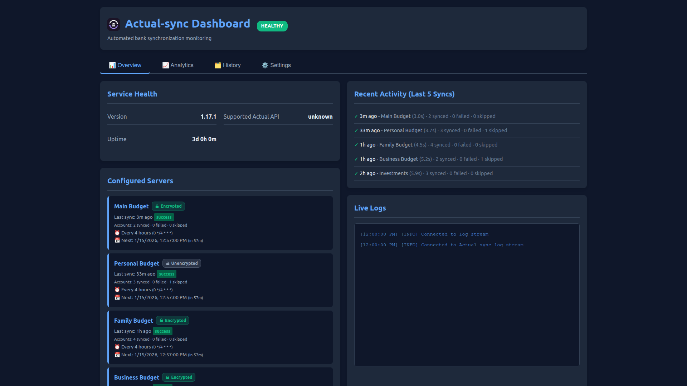
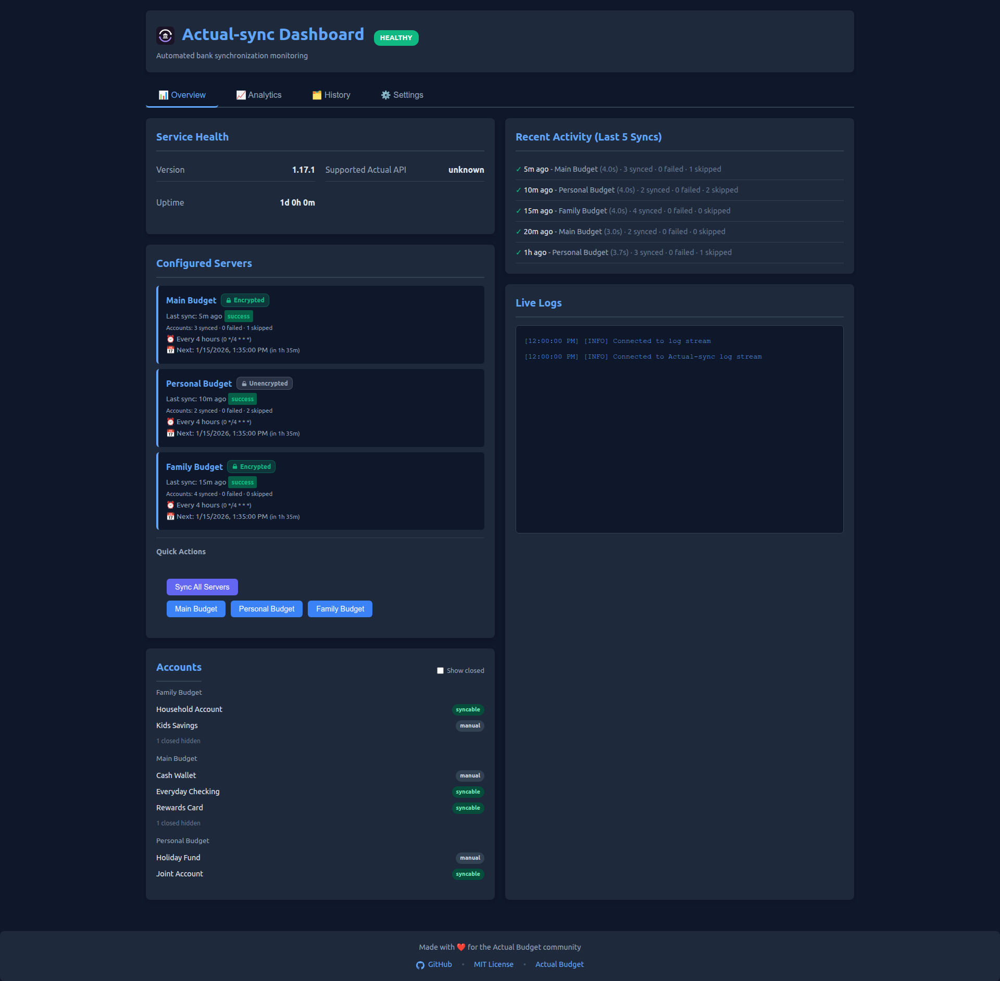
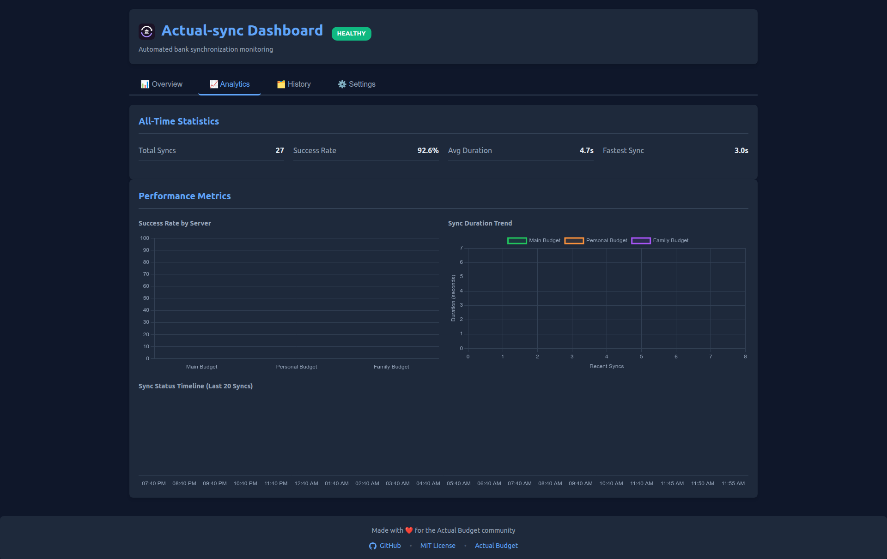
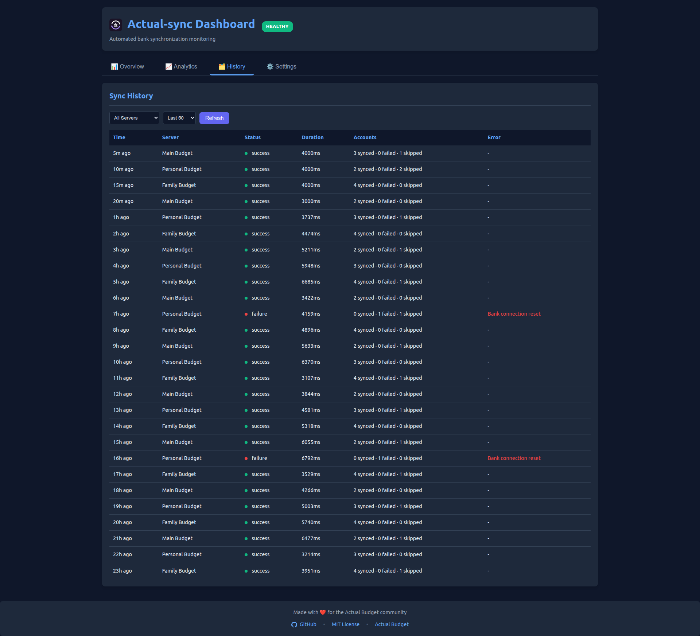
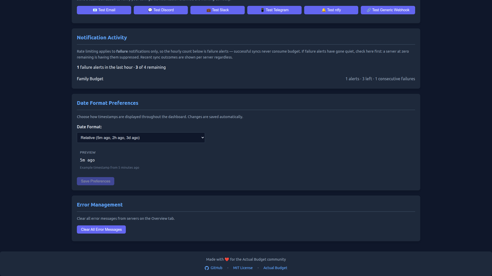
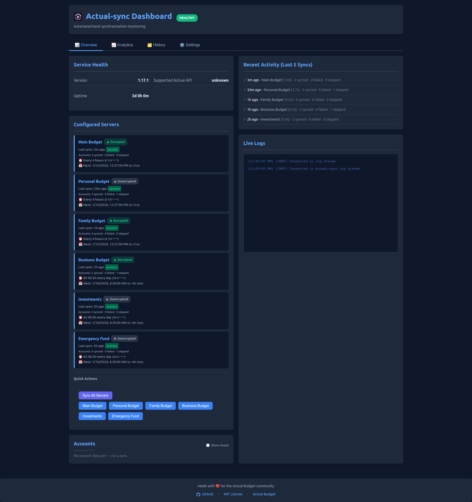
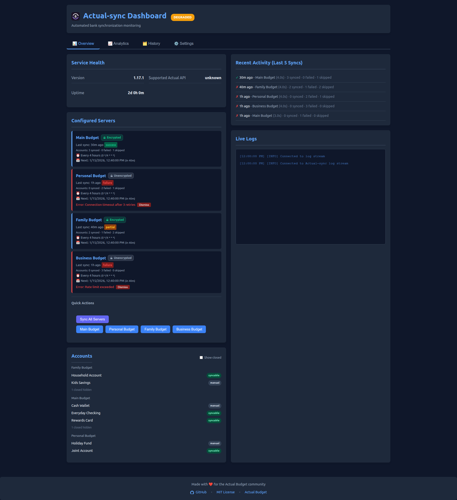

<p align="center">
  
</p>

<h1 align="center">Actual-sync</h1>

> Automated bank synchronization service for Actual Budget with multi-server support, health monitoring, and comprehensive error handling

<p align="center">
  <a href="https://github.com/agigante80/Actual-sync/releases"></a>
  <a href="https://github.com/agigante80/Actual-sync/actions/workflows/ci-cd.yml"></a>
  <a href="https://github.com/agigante80/Actual-sync/blob/main/docs/TESTING.md"></a>
  <a href="https://github.com/agigante80/Actual-sync/blob/main/docs/TESTING.md"></a>
  <a href="https://github.com/agigante80/Actual-sync/blob/main/LICENSE"></a>
  = 22">
  <a href="https://hub.docker.com/r/agigante80/actual-sync"></a>
  <a href="https://hub.docker.com/r/agigante80/actual-sync/tags"></a>
  <a href="https://github.com/agigante80/Actual-sync/pkgs/container/actual-sync"></a>
  <a href="https://ca.unraid.net/apps/actual-sync-13q9rt00idnw48"></a>
  <a href="https://github.com/agigante80/Actual-sync/stargazers"></a>
</p>

---

## 📚 Table of Contents

- [About](#-about)
- [Features](#-features)
- [Quick Start](#-quick-start)
- [Installation](#-installation)
- [Configuration](#%EF%B8%8F-configuration)
- [Usage](#-usage)
- [Docker Deployment](#-docker-deployment)
- [Monitoring & Observability](#-monitoring--observability)
- [Notifications](#-notifications)
- [Missing-Payment Alerts](#-missing-payment-alerts)
- [Testing](#-testing)
- [Security](#-security)
- [Troubleshooting](#-troubleshooting)
- [Documentation](#-documentation)
- [Contributing](#-contributing)
- [License](#-license)
- [Acknowledgments](#-acknowledgments)
- [Sponsor](#sponsor)

---

## 🧠 About

**Actual-sync** is a production-ready Node.js service that automates bank transaction synchronization for [Actual Budget](https://actualbudget.org) servers. Built for reliability and ease of use, it eliminates the need for manual sync operations and ensures your financial data stays current across multiple budget instances.

### What It Does

- **Automates** scheduled bank synchronization using cron expressions
- **Manages** multiple Actual Budget servers from a single service
- **Handles** network failures, rate limits, and API errors gracefully
- **Monitors** sync health with HTTP endpoints and Prometheus metrics
- **Notifies** you of sync results via Telegram, email, Slack, Discord, ntfy, or generic webhooks
- **Tracks** complete sync history in SQLite with CLI query tools

### Why Actual-sync?

Manually syncing bank transactions is tedious and error-prone. Actual-sync runs unattended in Docker or as a system service, keeping your budgets up-to-date with zero intervention. Perfect for personal finance enthusiasts, multi-user households, and anyone running self-hosted Actual Budget instances.

**Built for production** with enforced test coverage (see the live tests and coverage badges above), comprehensive error handling, structured logging, and enterprise-grade monitoring capabilities.

### 📸 Dashboard Preview

**Modern Tabbed Interface** with comprehensive monitoring and management:



<details>
<summary>📊 View More Screenshots</summary>

**Overview Tab** - 2-column layout with service health, server list, recent activity, and live logs:



**Analytics Tab** - All-time statistics with interactive charts:



**History Tab** - Searchable sync history with filters:



**Settings Tab** - Date format preferences and data management:



**Multi-Server Support** - Manage 6+ budget instances with encryption badges:



**Error Handling** - Clear visibility into partial failures and sync issues:



</details>

---

## ✨ Features

### 🎯 Core Capabilities

- ✅ **Multi-Server Support** - Manage unlimited Actual Budget instances with independent configurations
- ✅ **Encrypted Budget Support** - Full support for end-to-end encrypted (E2EE) budget files
- ✅ **Flexible Scheduling** - Global and per-server cron schedules with timezone support
- ✅ **Intelligent Retry Logic** - Exponential backoff with rate limit detection and handling
- ✅ **Account Discovery** - List all accessible bank accounts across servers
- ✅ **Manual Sync Trigger** - On-demand synchronization via CLI, dashboard or Telegram bot; inside the running service syncs run one at a time, so a manual sync waits for any sync already running (do not run `npm run sync` while the service is running: it is a separate process)
- ✅ **Configuration Validation** - Business rules (required fields, ranges, unique servers) and JSON-schema rules (types, ranges, formats, patterns, enums) both hard-fail at startup with clear, aggregated messages; unknown/typo'd keys warn. `CONFIG_STRICT=false` downgrades the schema hard-fails to warnings during a migration

### 📊 Monitoring & Observability

- ✅ **Modern Web Dashboard** - Tabbed interface with Overview, Analytics, History, and Settings
- ✅ **2-Column Overview Layout** - Service health, server list, recent activity, and live logs
- ✅ **Sync Status Badges** - Color-coded badges showing success/partial/failure for each server
- ✅ **Interactive Charts** - Success rates by server, duration trends, and sync timeline visualizations
- ✅ **Date Format Preferences** - 11 customizable date formats including 3-letter months (persisted in browser)
- ✅ **Orphaned Server Cleanup** - Identify and remove historical data for decommissioned budgets
- ✅ **Health Check Endpoints** - HTTP endpoints for monitoring (`/health`, `/metrics`, `/ready`)
- ✅ **Prometheus Metrics** - Comprehensive metrics export for Prometheus/Grafana dashboards
- ✅ **Structured Logging** - Pretty console + single-line JSON log files, correlation IDs, and automatic secret redaction (passwords/tokens never written to logs)
- ✅ **Enhanced Logging System** - Log rotation with compression, syslog support, performance tracking, per-server log levels
- ✅ **Sync History Database** - SQLite persistence with query interface and CLI tool (`npm run history`)
- ✅ **Status Tracking** - Real-time health status (HEALTHY/DEGRADED/UNHEALTHY/READY)
- ✅ **WebSocket Streaming** - Live log broadcast to connected dashboard clients with ring buffer; the stream uses the dashboard's auth and rejects foreign origins

### 🔔 Notifications & Alerts

- ✅ **Interactive Telegram Bot** - Real-time commands (`/status`, `/history`, `/errors`, `/sync`) with notifications
- ✅ **Multi-Channel Alerts** - Email (SMTP), Telegram, ntfy, and webhooks (Slack, Discord, and a generic JSON webhook for Gotify/Home Assistant/n8n/custom)
- ✅ **Honest Account Reporting** - Every notification shows which accounts synced, failed (with the error), or were skipped and why (closed / not bank-linked)
- ✅ **Per-Channel Notification Mode** - `notifyOnSuccess` (`always` / `errors_only` / `never`) set globally, per channel, or per webhook, so an alert channel can skip routine successes
- ✅ **Smart Thresholds** - Configurable failure detection (consecutive failures, failure rate) applied to failures
- ✅ **Rate Limiting** - Failure-notification spam prevention with configurable intervals
- ✅ **Missing-Payment Alerts** - Compares Actual's own schedules against posted transactions per server and notifies when an expected payment is late, missing, wrong-amount, or cannot be checked (stale bank connection); see [Missing-Payment Alerts](#-missing-payment-alerts)

### 🛡️ Reliability & Security

- ✅ **Comprehensive Testing** - extensive Jest suite with enforced coverage thresholds (70% lines/functions/statements, 61% branches); live counts on the badges above
- ✅ **Docker Support** - Production-ready containerization (Alpine-based; live image size on the badge above)
- ✅ **Security Best Practices** - Non-root user, credential warnings, HTTPS enforcement
- ✅ **Graceful Shutdown** - Proper cleanup handlers (SIGTERM/SIGINT)
- ✅ **Error Recovery** - Automatic retry with exponential backoff and jitter

### 🚀 Developer Experience

- ✅ **Zero External Dependencies** - Custom structured logger, no bloated libraries
- ✅ **Extensive Documentation** - 19 comprehensive guides covering all aspects
- ✅ **Example Configurations** - Docker Compose, Kubernetes, Prometheus, alerting
- ✅ **Migration Guides** - Step-by-step upgrade paths from previous versions

---

## 🚀 Quick Start

### Option 1: Docker (Recommended)

Get up and running in 2 minutes:

```bash
# Using Docker Hub
docker run -d \
  --name actual-sync \
  --restart unless-stopped \
  -v ./config:/app/config:ro \
  -v ./data:/app/data \
  -v ./logs:/app/logs \
  -p 3000:3000 \
  -e PUID=1001 -e PGID=1001 \
  -e TZ=America/New_York \
  agigante80/actual-sync:latest

# OR using GitHub Container Registry
docker run -d \
  --name actual-sync \
  --restart unless-stopped \
  -v ./config:/app/config:ro \
  -v ./data:/app/data \
  -v ./logs:/app/logs \
  -p 3000:3000 \
  -e PUID=1001 -e PGID=1001 \
  -e TZ=America/New_York \
  ghcr.io/agigante80/actual-sync:latest
```

Create `config/config.json` in your mounted directory and you're ready to go!

> **PUID / PGID:** the container starts as root only to align its user to `PUID`/`PGID`
> (default `1001:1001`) and fix ownership of the `data` and `logs` volumes, then drops
> to that non-root user. Set these to match the owner of your mounted directories — on
> **Unraid** use `PUID=99` and `PGID=100` (`nobody:users`). Without this, a container
> whose volumes are owned by a different UID cannot write its database or logs.

See **[docs/DOCKER_DEPLOYMENT.md](docs/DOCKER_DEPLOYMENT.md)** for complete Docker setup.

### Option 2: NPM Installation

For development or manual setup:

```bash
# 1. Clone and install
git clone https://github.com/agigante80/Actual-sync.git
cd Actual-sync
npm install

# 2. Create configuration
cp config/config.example.json config/config.json

# 3. Edit configuration with your Actual Budget server details
nano config/config.json

# 4. Discover available accounts
npm run list-accounts

# 5. Test manual sync
npm run sync

# 6. Start scheduled service
npm start
```

### Option 3: Unraid (Community Applications)

[](https://ca.unraid.net/apps/actual-sync-13q9rt00idnw48)

actual-sync is published in the Unraid **Community Applications** store: **[ca.unraid.net/apps/actual-sync](https://ca.unraid.net/apps/actual-sync-13q9rt00idnw48)**.

Install it from the **Apps** tab (Community Applications):

1. Open the **Apps** tab and search for **`actual-sync`**.
2. Click **Install** and set the **Config** path.
3. **Single budget (simplest):** fill in the **Actual server URL / password / Sync ID** template variables and start — no config file needed (Sync ID: Actual Budget → the budget → **Settings → Advanced → "Sync ID"**). **Multiple budgets:** leave those blank; on first start the container drops a **`config.example.json`** in the Config folder and exits — fill it in, rename it to **`config.json`**, and restart (see [Configuration](#%EF%B8%8F-configuration)).
4. Open the dashboard via the container's **WebUI** link (port `3000`).

The Unraid template lives in [`unraid/actual-sync.xml`](unraid/actual-sync.xml).

> **Single-server via environment variables** (any Docker host, not just Unraid): set `ACTUAL_SYNC_SERVER_URL`, `ACTUAL_SYNC_SERVER_PASSWORD`, and `ACTUAL_SYNC_SERVER_SYNC_ID` to run one budget with no `config.json`. See [Configuration](docs/CONFIG.md#single-server-configuration-via-environment-variables).

---

## 📦 Installation

### Prerequisites

- **Node.js 22+**
- **Actual Budget Server** - Self-hosted instance with configured bank connections
- **GoCardless/Nordigen** - Open banking API credentials configured in Actual Budget
- **Docker** (optional) - For containerized deployment

### Method 1: Docker (Recommended for Production)

Pull from Docker Hub or GitHub Container Registry:

```bash
# Option A: Docker Hub
docker pull agigante80/actual-sync:latest

# Option B: GitHub Container Registry
docker pull ghcr.io/agigante80/actual-sync:latest

# Run container
docker run -d \
  --name actual-sync \
  --restart unless-stopped \
  -v $(pwd)/config:/app/config:ro \
  -v $(pwd)/data:/app/data \
  -v $(pwd)/logs:/app/logs \
  -p 3000:3000 \
  -e PUID=1001 -e PGID=1001 \
  -e TZ=America/New_York \
  agigante80/actual-sync:latest
```

**Docker Compose:**

```yaml
version: '3.8'
services:
  actual-sync:
    image: agigante80/actual-sync:latest  # or ghcr.io/agigante80/actual-sync:latest
    container_name: actual-sync
    restart: unless-stopped
    ports:
      - "3000:3000"
    volumes:
      - ./config:/app/config:ro
      - ./data:/app/data
      - ./logs:/app/logs
    environment:
      - PUID=1001          # set to 99 on Unraid (nobody)
      - PGID=1001          # set to 100 on Unraid (users)
      - TZ=America/New_York
      - NODE_ENV=production
```

See **[docs/DOCKER_DEPLOYMENT.md](docs/DOCKER_DEPLOYMENT.md)** for advanced Docker configuration.

### Method 2: NPM Installation (Recommended for Development)

```bash
# Clone repository
git clone https://github.com/agigante80/Actual-sync.git
cd Actual-sync

# Install dependencies
npm install

# Verify installation
npm test
npm run list-accounts --help
```

### Method 3: System Service (Linux)

```bash
# Install as systemd service
sudo cp actual-sync.service /etc/systemd/system/
sudo systemctl daemon-reload
sudo systemctl enable actual-sync
sudo systemctl start actual-sync
```


---

## ⚙️ Configuration

Configuration is managed via `config/config.json` with JSON schema validation.

### Basic Configuration

```json
{
  "servers": [
    {
      "name": "Main",
      "url": "https://budget.example.com",
      "password": "your_secure_password",
      "syncId": "your_sync_id_from_actual",
      "dataDir": "/app/data/main",
      "encryptionPassword": "MyBudgetEncryptionKey"
    }
  ],
  "sync": {
    "maxRetries": 5,
    "baseRetryDelayMs": 3000,
    "schedule": "0 2 * * *"
  },
  "logging": {
    "level": "INFO",
    "format": "pretty",
    "logDir": "/app/logs"
  },
  "healthCheck": {
    "port": 3000,
    "host": "0.0.0.0"
  }
}
```

**Configuration Notes:**

- **`encryptionPassword`** (optional): Required only if your budget file has end-to-end encryption (E2EE) enabled. This is separate from the server password.
- **`logDir`**: Set to `/app/logs` for Docker deployments, or `./logs` for local development. Set to `null` to disable file logging and log only to console.
```

### Configuration Validation

```bash
# Validate configuration file
npm run validate-config

# Or manually
node -e "require('./src/lib/configLoader'); new (require('./src/lib/configLoader'))().load()"
```

See **[docs/CONFIG.md](docs/CONFIG.md)** for complete configuration reference including:
- Advanced multi-server configurations
- Per-server schedule overrides
- Notification setup (Email, Telegram, Slack, Discord, ntfy, generic webhooks)
- Retry logic customization
- Timezone configuration
- Environment variable alternatives

---

## 🎮 Usage

### NPM Scripts

| Script | Command | Description |
|--------|---------|-------------|
| `npm start` | `node index.js` | Start scheduled sync service (background) |
| `npm run sync` | `node index.js --force-run` | Run immediate sync for all servers (skip schedule wait) |
| `npm run sync -- --server "ServerName"` | `node index.js --force-run --server "ServerName"` | Run immediate sync for specific server only |
| `npm run list-accounts` | `node scripts/listAccounts.js` | List all configured bank accounts |
| `npm run history` | `node scripts/viewHistory.js` | View sync history and statistics |
| `npm run validate-config` | `node scripts/validateConfig.js` | Validate configuration file |
| `npm run screenshots` | `node scripts/generateDashboardScreenshots.js` | Generate dashboard screenshots from the e2e fixture harness |
| `npm test` | `jest` | Run test suite |
| `npm run test:watch` | `jest --watch` | Run tests in watch mode |
| `npm run test:coverage` | `jest --coverage` | Generate coverage report |
| `npm run test:e2e` | `jest --config jest.e2e.config.js` | Run the browser E2E suite (see [TESTING.md](docs/TESTING.md#-browser-e2e-tests-263)) |

### Command Line Examples

**List all accounts:**

```bash
npm run list-accounts

# Output:
# Server: Main
# ✓ Connected successfully
# 
# Accounts:
# 1. Chase Checking (ID: acct_123) - Last sync: 2025-12-07
# 2. Savings Account (ID: acct_456) - Last sync: 2025-12-06
# 3. Credit Card (ID: acct_789) - Last sync: 2025-12-07
```

**Run sync for all servers:**

```bash
npm run sync
```

**Run sync for a specific server:**

```bash
npm run sync -- --server "Main Budget"

# Example output:
# Starting sync for server: Main Budget
# ✅ Sync completed successfully
```

**View sync history:**

```bash
npm run history

# Options:
npm run history -- --server Main --days 7 --status failed
npm run history -- --stats
npm run history -- --errors
```

### Telegram Bot Commands

If you've configured the Telegram bot, you can interact with the service:

- `/status` - Show current sync status and health
- `/history [count]` - View recent sync history (default: last 5)
- `/errors [count]` - Show recent errors (default: last 5)
- `/stats` - Show sync statistics
- `/servers` - List configured servers
- `/sync ServerName` - Trigger manual sync for specific server
- `/notify [always|errors|never]` - Change notification preferences at runtime (the command's `errors` is the config's `errors_only`)
- `/help` - Show all available commands
- `/ping` - Test bot connectivity
- `/stats` - Show sync statistics
- `/help` - List available commands

See **[docs/NOTIFICATIONS.md](docs/NOTIFICATIONS.md)** for Telegram bot setup.

---

## 🐳 Docker Deployment

### Available Registries

Actual-sync is published to two registries:

- **Docker Hub**: `agigante80/actual-sync:latest`
- **GitHub Container Registry**: `ghcr.io/agigante80/actual-sync:latest`

Both registries contain identical multi-platform images (amd64/arm64).

### Docker Compose (Recommended)

```yaml
version: '3.8'

services:
  actual-sync:
    image: agigante80/actual-sync:latest  # or ghcr.io/agigante80/actual-sync:latest
    container_name: actual-sync
    restart: unless-stopped
    
    ports:
      - "3000:3000"  # Health check endpoint
    
    volumes:
      - ./config:/app/config:ro      # Read-only config
      - ./data:/app/data              # Persistent data (SQLite)
      - ./logs:/app/logs              # Log files
    
    environment:
      - PUID=1001                     # Run-as UID (99 on Unraid)
      - PGID=1001                     # Run-as GID (100 on Unraid)
      - TZ=America/New_York           # Timezone for schedules
      - NODE_ENV=production
    
    healthcheck:
      test: ["CMD", "wget", "--quiet", "--tries=1", "--spider", "http://localhost:3000/health"]
      interval: 30s
      timeout: 10s
      retries: 3
      start_period: 40s
    
    networks:
      - actual-network

networks:
  actual-network:
    external: true
```

**Deploy:**

```bash
docker-compose up -d

# View logs
docker-compose logs -f actual-sync

# Check health
docker-compose ps
curl http://localhost:3000/health
```

See **[docs/DOCKER_DEPLOYMENT.md](docs/DOCKER_DEPLOYMENT.md)** for Kubernetes deployment and advanced configurations.

---

## 📝 Logging

Actual-sync provides comprehensive logging with multiple output formats and destinations.

### Log Configuration

Configure logging in `config/config.json`:

```json
{
  "logging": {
    "level": "INFO",
    "format": "json",
    "logDir": "/app/logs",
    "rotation": {
      "enabled": true,
      "maxSize": "10M",
      "maxFiles": 10,
      "compress": "gzip"
    }
  }
}
```

### Log Levels

- **`ERROR`**: Critical failures requiring immediate attention
- **`WARN`**: Warnings and retry attempts
- **`INFO`**: Normal operations (recommended for production)
- **`DEBUG`**: Detailed tracing for troubleshooting

### Log Formats

**Pretty Format** (Human-readable, for development):
```
2025-12-09T22:06:15.204Z [INFO] Starting sync for server: Vega II
2025-12-09T22:06:15.564Z [INFO] Connected to Actual server
2025-12-09T22:06:16.440Z [INFO] Accounts fetched successfully
```

**JSON Format** (Machine-readable, for production):
```json
{"timestamp":"2025-12-09T22:06:15.204Z","level":"INFO","service":"actual-sync","message":"Starting sync for server: Vega II","server":"Vega II","correlationId":"9a313fa1-8901-4e3f-a167-5e3e1e8cbee3"}
```

### Log Destinations

**File Logging** (Docker):
```bash
# Logs are written to /app/logs inside the container
# Mount this directory to persist logs on the host
docker run -v ./logs:/app/logs agigante80/actual-sync:latest

# View logs
tail -f ./logs/actual-sync-2025-12-09.log
```

**Console Only** (Disable file logging):
```json
{
  "logging": {
    "level": "INFO",
    "format": "pretty",
    "logDir": null
  }
}
```

**Docker Logs** (Recommended for Docker deployments):
```bash
# View real-time logs
docker logs -f actual-sync

# View last 100 lines
docker logs --tail 100 actual-sync

# View logs since specific time
docker logs --since 2025-12-09T00:00:00 actual-sync
```

### Log Rotation

When file logging is enabled, logs are automatically rotated to prevent disk space issues:

- **Max Size**: 10MB per file (configurable)
- **Max Files**: 10 files kept (configurable)
- **Compression**: Old logs compressed with gzip
- **Daily Rotation**: New file created each day

See **[docs/LOGGING.md](docs/LOGGING.md)** for advanced logging configuration including syslog support and performance tracking.

---

## 📊 Monitoring & Observability

### Web Dashboard

Access the interactive dashboard at `http://localhost:3000/dashboard`:


#### Dashboard Screenshots

**Healthy System - Main Dashboard View**


*Real-time monitoring with success metrics, interactive charts, and live log streaming*

---

**Degraded System - Multiple Servers with Errors**


*Dashboard showing failure detection across multiple budget servers with detailed error tracking*

---

**Multi-Server Setup - 6 Budget Instances**


*Managing multiple budget instances with per-server status and consolidated metrics*

---

**Dashboard Capabilities:**
- 📈 **Real-time Charts** - Success rates, duration trends, sync timelines
- 🖥️ **System Status** - Live uptime, statistics, and server health
- 🎮 **Manual Controls** - Trigger syncs for all servers or individual ones
- 📡 **Live Logs** - WebSocket-streamed logs with color-coding
- 📊 **Metrics Visualization** - Interactive Chart.js graphs
- 🔒 **Authentication** - Optional basic auth or token-based security

**Quick Access:**
```bash
# Default (no auth)
open http://localhost:3000/dashboard

# With authentication configured
curl -u admin:password http://localhost:3000/dashboard
```

**Regenerating Screenshots:**

When dashboard features change, regenerate screenshots:
```bash
# Start the service first
npm start

# In another terminal, generate screenshots
npm run screenshots
```

See **[docs/DASHBOARD.md](docs/DASHBOARD.md)** for complete dashboard documentation including authentication setup, API endpoints, and reverse proxy configuration.

### Health Check Endpoints

Actual-sync exposes HTTP endpoints for monitoring:

| Endpoint | Description | Response |
|----------|-------------|----------|
| `GET /health` | Basic alive check | `200 OK` or `503 Service Unavailable` |
| `GET /metrics` | Detailed sync statistics | JSON with per-server status |
| `GET /ready` | Kubernetes readiness probe | `200 OK` when service is ready |
| `GET /dashboard` | Web dashboard UI | HTML dashboard interface |
| `WS /ws/logs` | Live log stream (dashboard auth, same-origin only) | JSON log records |

**Example - Health Check:**

```bash
curl http://localhost:3000/health

# Response (200 OK):
{
  "status": "HEALTHY",
  "uptime": 86400,
  "timestamp": "2025-12-07T14:32:10.123Z",
  "version": "1.4.0"
}
```

### Prometheus Metrics

Actual-sync exports Prometheus metrics on port 3000:

```bash
curl http://localhost:3000/metrics/prometheus
```

**Prometheus Configuration:**

```yaml
# prometheus.yml
scrape_configs:
  - job_name: 'actual-sync'
    static_configs:
      - targets: ['actual-sync:3000']
    scrape_interval: 30s
    metrics_path: /metrics/prometheus
```

See **[docs/PROMETHEUS.md](docs/PROMETHEUS.md)** and **[docs/HEALTH_CHECK.md](docs/HEALTH_CHECK.md)** for complete monitoring setup including Grafana dashboards.

---

## 🔔 Notifications

Actual-sync can send notifications on sync results — success, partial, or failure — via multiple channels. Each channel decides for itself which results are worth a message, so an alert channel can stay quiet on routine successes:

### Supported Channels

- **Email** - SMTP (Gmail, SendGrid, custom)
- **Telegram** - Interactive bot with commands
- **Slack** - Webhook integration
- **Discord** - Webhook integration
- **ntfy** - Push notifications to an ntfy topic (priority + tags)
- **Generic webhook** - POSTs a documented JSON payload to any URL (works with Gotify, Home Assistant, n8n, Apprise, or custom endpoints)

### Notification Mode (per channel)

`notifyOnSuccess` decides which sync results reach a channel. Set it globally under `notifications`, and override it per channel — or per individual webhook entry:

- **`always`** (default) — notify on every sync
- **`errors_only`** — notify on failures and partial syncs, stay silent on clean successes
- **`never`** — turn the channel off entirely, failures included

```json
"notifications": {
  "notifyOnSuccess": "errors_only",
  "email": { "notifyOnSuccess": "always" }
}
```

Test notifications from the dashboard always send, so you can still verify a muted channel.

### Smart Thresholds

**Failures only.** Once a channel is set to notify on a failure, these decide whether that failure is worth alerting about — they do not apply to success or partial results:

- **Consecutive Failures**: Alert after N consecutive failed syncs (default: 3)
- **Failure Rate**: Alert when failure rate exceeds X% over Y minutes (default: 50% over 60 min)

### Rate Limiting

**Failures only**, like thresholds. To quieten routine success notifications, use `notifyOnSuccess: "errors_only"` above — rate limiting will not do it:

- **Minimum Interval**: Don't send notifications more frequently than X minutes (default: 15)
- **Maximum Per Hour**: Don't send more than X notifications per hour (default: 4)

### Message templates

Notification wording is being made user-configurable, using [Handlebars](https://handlebarsjs.com/) syntax: the same engine and `{{ variable }}` placeholders Actual Budget uses for rule action templates, so Actual users already know it. A template is validated at startup: an unknown variable, an unregistered helper, or (for Telegram) literal markup Telegram would reject all fail fast, naming the offending token and line rather than failing silently at send time.

English example:

```handlebars
{{name}}'s payment of {{amount}} is due {{deadline}}.
```

Spanish example:

```handlebars
El pago de {{amount}} de {{name}} vence el {{deadline}}.
```

A server's `scheduleAlerts.alerts[].templates` (or block-level `scheduleAlerts.templates`) block is the first configuration surface that uses this engine - see [Missing-Payment Alerts](#-missing-payment-alerts) below. See **[docs/NOTIFICATIONS.md](docs/NOTIFICATIONS.md)** for the full syntax, the variable and helper whitelist, and the per-channel output rules.

See **[docs/NOTIFICATIONS.md](docs/NOTIFICATIONS.md)** for complete notification setup guide including configuration examples for all channels.

---

## 💸 Missing-Payment Alerts

Actual-sync can watch a server's own [Actual schedules](https://actualbudget.org/docs/budgeting/schedules/) and tell you when an expected recurring payment did not behave as expected - a rent that never went out, a salary that arrived for the wrong amount, a bank connection too stale to trust. It never invents its own cadence: the schedule's own recurrence, in Actual, is the single source of truth.

Enable it per server with a `scheduleAlerts` block:

```json
{
  "servers": [
    {
      "name": "Main",
      "scheduleAlerts": {
        "staleAfterDays": 3,
        "alerts": [
          { "id": "rent", "schedule": "Rent - Apartment", "graceDays": 6 },
          { "id": "salary", "schedule": "Salary", "graceDays": 3, "earlyDays": 5, "amountTolerancePct": 0 }
        ]
      }
    }
  ]
}
```

A server with no `scheduleAlerts` block never calls `getSchedules()` and pays no cost for this feature. The step runs once per sync, after the bank-sync loop, inside the same Actual session; any error in it is logged at WARN and never changes the sync's own recorded result.

### Ten scenarios

Every scenario below (except #9, which needs a shorter cadence to demonstrate) uses the same
schedule, configured in Actual as: recurrence **Monthly, on the 5th**; amount **-850.00** (an
expense); account **Checking**; payee **Landlord LLC**; name **"Rent - Apartment"**. Timezone is
`Europe/Madrid`, `dateFormat` is left at its default (`D MMM YYYY`), and the destination channel is
a configured Slack webhook unless noted. Each message below is rendered by the real `deliver()`
code against that exact fixture, not paraphrased.

**1. On time** - a transaction for -850.00 posts to Checking on 5 Oct 2026 (the occurrence date
itself), linked to the schedule in Actual.

```json
{ "id": "rent", "schedule": "Rent - Apartment", "graceDays": 6 }
```

No event, no message: an on-time payment produces nothing to report.

**2. Missing** - nothing has posted to Checking by the deadline (5 Oct + `graceDays: 6` = 11 Oct),
and the account's `last_sync` is past that deadline. Sync runs on 12 Oct 2026.

```json
{ "id": "rent", "schedule": "Rent - Apartment", "graceDays": 6 }
```

> ⚠️ Rent - Apartment did not go out. -850.00 to Landlord LLC from Checking was due 5 Oct 2026.

**3. Resolved** - the sync on 12 Oct sends the `missing` alert above. Three days later, on 15 Oct,
the payment posts (4 days after the 11 Oct deadline). The next sync closes it out with a `resolved`
alert; no manual dismissal is needed.

```json
{ "id": "rent", "schedule": "Rent - Apartment", "graceDays": 6 }
```

> ⚠️ Rent - Apartment did not go out. -850.00 to Landlord LLC from Checking was due 5 Oct 2026.
>
> *(3 days later, once the payment posts:)*
>
> ✅ Rent - Apartment: -850.00 arrived 15 Oct 2026, 4 day(s) after the deadline. Alert closed.

**4. Wrong amount** - a transaction for -800.00 (not -850.00) posts to Checking, matching account
and payee within the window, on 5 Oct 2026. The rule's amount mode is exact (Actual's schedule
amount is `is`, not `approximately`), so `amountTolerancePct` defaults to `0`.

```json
{ "id": "rent", "schedule": "Rent - Apartment", "graceDays": 6 }
```

> ⚠️ Rent - Apartment: received -800.00 on 5 Oct 2026, expected -850.00 (difference 50.00).

**5. Stale connection** - nothing has posted, and Checking's `last_sync` is 8 Oct 2026 while the
sync runs on 15 Oct - 7 days old, more than `staleAfterDays: 3`. A `cannotCheck` alert (reason
`stale`) fires instead of a false `missing`.

```json
{
  "staleAfterDays": 3,
  "alerts": [{ "id": "rent", "schedule": "Rent - Apartment", "graceDays": 6 }]
}
```

> ⏸️ Cannot check Rent - Apartment: Checking has not synced since 8 Oct 2026 (deadline 11 Oct 2026). Check the bank connection.

**6. Not yet synced** - the sync runs on 13 Oct 2026 (past the 11 Oct deadline), and Checking's
`last_sync` is 11 Oct - fresh enough not to be stale (2 days old, under `staleAfterDays: 3`), but
still at/before the deadline itself, so there has been no chance yet to see the payment. A
`cannotCheck` alert (reason `not-synced`) fires instead of `missing`.

```json
{
  "staleAfterDays": 3,
  "alerts": [{ "id": "rent", "schedule": "Rent - Apartment", "graceDays": 6 }]
}
```

> ⏸️ Cannot check Rent - Apartment: Checking has not synced since 11 Oct 2026 (deadline 11 Oct 2026). Check the bank connection.

**7. Recurring reminder** - the same `missing` alert as scenario 2 stays unresolved. With
`remindEveryDays: 3` set, it repeats every 3 calendar days (in the configured timezone) instead of
firing once and going silent: the sync on 12 Oct sends it, and the sync on 15 Oct (3 days later,
still unresolved) sends the identical message again rather than staying silent.

```json
{ "id": "rent", "schedule": "Rent - Apartment", "graceDays": 6, "remindEveryDays": 3 }
```

> ⚠️ Rent - Apartment did not go out. -850.00 to Landlord LLC from Checking was due 5 Oct 2026.
>
> *(repeated verbatim 3 days later, since the payment is still missing)*
>
> ⚠️ Rent - Apartment did not go out. -850.00 to Landlord LLC from Checking was due 5 Oct 2026.

**8. Renamed or deleted schedule** - the rule watches `"Rent - Apartment (old name)"`, but the
schedule in Actual was renamed to `"Rent - Apartment"` (or deleted). The rule's own `schedule`/
`schedulePrefix` matches nothing.

```json
{ "id": "rent", "schedule": "Rent - Apartment (old name)", "graceDays": 6 }
```

> ❓ Payment alert "rent" matches no schedule in Main. Check the schedule name in Actual.

This repeats once per day while unmatched (a fixed interval, independent of `remindEveryDays`).

**9. Overlapping windows** - a *weekly* schedule (7-day interval between occurrences) with
`graceDays: 5, earlyDays: 3` (5 + 3 = 8, greater than or equal to the 7-day interval): a late
payment for one week's occurrence could be counted as an early payment for the next, or vice versa.
The rule is skipped for that sync rather than risk a wrong result - one `cannotCheck` alert (reason
`interval-violation`, no `occurrence`/`deadline` since none is being evaluated) plus a logged
warning naming the rule and the exact numbers.

```json
{ "id": "rent", "schedule": "Rent - Apartment", "graceDays": 5, "earlyDays": 3 }
```

Logged warning:

> Rule "rent": graceDays (5) + earlyDays (3) >= the schedule's shortest interval between occurrences (7 days); the on-time and late windows of consecutive occurrences would overlap, so this rule was skipped.

Sent alert (the shared `cannotCheck` template has no `occurrence`/`deadline` to fill in for this
reason, so those two fields render blank - this is expected for `interval-violation`):

> ⏸️ Cannot check Rent - Apartment: Checking has not synced since  (deadline ). Check the bank connection.

**10. Digest** - in the same sync, the Rent rule above is `missing` and a second rule, watching an
income schedule **"Salary"** (recurrence Monthly on the 5th, expected +3200.00 into Checking from
"Employer Inc"), receives +3000.00 instead - a `wrongAmount`. With `digest: true` set on the block,
both are merged into one message per channel instead of two separate messages; the ledger still
records one row per event, per destination, so de-duplication and reminders work exactly as without
digest.

```json
{
  "staleAfterDays": 3,
  "digest": true,
  "alerts": [
    { "id": "rent", "schedule": "Rent - Apartment", "graceDays": 6 },
    { "id": "salary", "schedule": "Salary", "graceDays": 3, "earlyDays": 5, "amountTolerancePct": 0 }
  ]
}
```

> Actual-sync: 2 payment alert(s) for Main
>
> ⚠️ Rent - Apartment did not go out. -850.00 to Landlord LLC from Checking was due 5 Oct 2026.
> ⚠️ Salary: received 3000.00 on 5 Oct 2026, expected 3200.00 (difference -200.00).

### Variables

Every template (built-in or an override under `templates`) can reference these; each has a raw (`_raw`) counterpart carrying the underlying value (a number or an unformatted ISO date) for a template author who wants to format it differently.

| Variable | Meaning |
|---|---|
| `name` | The alert's schedule name (or the rule's `id`, for `ruleUnmatched`) |
| `payee` | The schedule's payee name |
| `account` | The schedule's account name |
| `direction` | `expense` or `income`, derived from the expected amount's sign |
| `expected_amount` / `expected_amount_raw` | The schedule's expected amount |
| `expected_date` / `expected_date_raw` | The occurrence's calendar date |
| `deadline` / `deadline_raw` | Occurrence date + `graceDays` |
| `grace_days` | The rule's configured `graceDays` |
| `period` | The occurrence's month (or the following month, when `period: "next"`) |
| `cadence` | Actual's own recurrence wording (e.g. "Every month on the 5th") |
| `days_overdue` / `days_overdue_raw` | Days past the deadline |
| `received_amount` / `received_amount_raw` | The amount actually received |
| `received_date` / `received_date_raw` | The date the matching transaction posted |
| `difference` / `difference_raw` | `received_amount - expected_amount` (for `wrongAmount`) |
| `last_sync` / `last_sync_raw` | The account's last successful sync date (for `cannotCheck`) |
| `budget` | The server name |
| `alert_id` | The rule's `id` |

A variable that does not apply to the current event type is always present as `null`, so a template can reference it without an `{{#if}}` guard.

### Timezone

Every date in this feature - an occurrence date, a deadline, "today", account staleness - is computed in one timezone: `timezone` from the top-level config, falling back to the host machine's own local IANA zone (`Intl.DateTimeFormat().resolvedOptions().timeZone`) when unset. A global `timezone` config key does not exist yet (tracked separately); until it does, every server's alerts use the sync process's own local zone.

See **[docs/SCHEDULE_ALERTS.md](docs/SCHEDULE_ALERTS.md)** for the full configuration reference, the algorithm's edge cases, and message-template overrides.

---

## 🧪 Testing

Actual-sync has comprehensive test coverage to ensure reliability.

### Run Tests

```bash
# Run all tests
npm test

# Watch mode (for development)
npm run test:watch

# Generate coverage report
npm run test:coverage
```

### Test Coverage

```
--------------------|---------|----------|---------|---------|-------------------
File                | % Stmts | % Branch | % Funcs | % Lines | Uncovered Line #s
--------------------|---------|----------|---------|---------|-------------------
All files           |   ...   |   ...    |   ...   |   ...   |                   
--------------------|---------|----------|---------|---------|-------------------

Test Suites: all passing
Tests:       all passing      # live count + coverage are on the badges at the top
Time:        ~8 s
```

See **[docs/TESTING.md](docs/TESTING.md)** for complete testing guide including:
- Test structure and organization
- Writing new tests
- CI/CD integration
- Coverage thresholds

---

## 🔒 Security

### Credential Management

**DO:**
- ✅ Store credentials in `config/config.json` (git-ignored)
- ✅ Use strong passwords (16+ characters, mixed complexity)
- ✅ Rotate credentials periodically (quarterly recommended)
- ✅ Use HTTPS for all Actual Budget server URLs

**DON'T:**
- ❌ Hardcode credentials in source files
- ❌ Commit `config/config.json` to version control
- ❌ Share credentials in public channels
- ❌ Use same password across multiple servers

### Security Features

- **Non-Root Container** - Docker runs as `actualuser` (UID 1001), not root
- **Read-Only Config** - Mount config as read-only in Docker
- **HTTPS Enforcement** - Warnings for HTTP connections in production
- **Rate Limiting** - HTTP endpoints protected (60 req/min per IP), and dashboard logins lock out after 10 failures per IP in 15 minutes
- **SQL Injection Protection** - Parameterized queries throughout
- **Input Validation** - Startup business-logic validation, plus hard-fail JSON-schema validation (type/range/required/format/pattern/enum; unknown keys warn) for all config

### Security Status

Dependency vulnerabilities are tracked live on the repository's
**[Security tab](https://github.com/agigante80/Actual-sync/security/dependabot)**
(Dependabot alerts), so this README carries no static security score that could
go stale. The codebase's standing practices:

- ✅ No hardcoded credentials
- ✅ SQL injection protection (parameterized queries throughout)
- ✅ Container security best practices (non-root user, read-only config)
- ✅ Startup config validation and automatic secret redaction in logs

See **[docs/SECURITY_AND_PRIVACY.md](docs/SECURITY_AND_PRIVACY.md)** for details.

### Vulnerability Reporting

Please report security vulnerabilities privately via GitHub's
**[Report a vulnerability](https://github.com/agigante80/Actual-sync/security/advisories/new)**
form (Security tab → Report a vulnerability). Do not open public GitHub issues
for security vulnerabilities.

---

## 🐛 Troubleshooting

### Common Issues

#### Configuration file not found

```bash
# Solution: Create from example
cp config/config.example.json config/config.json
```

#### Invalid configuration

```bash
# Solution: Validate configuration
npm run validate-config
```

#### Connection issues

```bash
# 1. Verify server URL is accessible
curl https://budget.example.com

# 2. Check credentials
npm run list-accounts

# 3. Check logs for detailed error messages
tail -f logs/actual-sync-*.log
```

#### Rate limit errors

```
Error: Rate limit exceeded (429)
```

**Solutions:**
- Increase `sync.baseRetryDelayMs` (e.g., 5000)
- Reduce sync frequency (e.g., `"0 */12 * * *"` for every 12 hours)
- Check GoCardless/Nordigen API limits

#### Docker container exits immediately

```bash
# 1. Check logs
docker logs actual-sync

# 2. Verify volume mounts
docker inspect actual-sync | grep -A 10 Mounts

# 3. Run interactively to debug
docker run --rm -it \
  -v $(pwd)/config:/app/config:ro \
  actual-sync:latest \
  npm run validate-config
```

### Debug Mode

Enable detailed logging for troubleshooting:

```json
{
  "logging": {
    "level": "DEBUG",
    "format": "pretty"
  }
}
```

### Getting Help

1. **Check Documentation** - See [docs/](docs/) for comprehensive guides
2. **View Logs** - Check `logs/actual-sync-*.log` for error details
3. **Run Diagnostics** - Use `npm run list-accounts` to test connectivity
4. **GitHub Issues** - Create issue with logs and configuration (redact credentials)

---

## 📚 Documentation

Comprehensive documentation is available in the `docs/` directory:

### Getting Started
- **[docs/README.md](docs/README.md)** - Documentation index and quick links
- **[docs/CONFIG.md](docs/CONFIG.md)** - Complete configuration reference
- **[docs/MIGRATION.md](docs/MIGRATION.md)** - Upgrade guide from previous versions

### Architecture & Design
- **[docs/ARCHITECTURE.md](docs/ARCHITECTURE.md)** - System design and components
- **[docs/CONFIG.md](docs/CONFIG.md)** - Full configuration reference

### Operations & Monitoring
- **[docs/DOCKER_DEPLOYMENT.md](docs/DOCKER_DEPLOYMENT.md)** - Docker deployment guide
- **[docs/HEALTH_CHECK.md](docs/HEALTH_CHECK.md)** - Health check endpoints and monitoring
- **[docs/DASHBOARD.md](docs/DASHBOARD.md)** - Web dashboard
- **[docs/PROMETHEUS.md](docs/PROMETHEUS.md)** - Prometheus metrics and Grafana dashboards
- **[docs/LOGGING.md](docs/LOGGING.md)** - Structured logging guide
- **[docs/SYNC_HISTORY.md](docs/SYNC_HISTORY.md)** - Sync history database and CLI tool

### Features & Configuration
- **[docs/NOTIFICATIONS.md](docs/NOTIFICATIONS.md)** - Notification setup (Email, Telegram, Slack, Discord, ntfy, generic webhooks)
- **[docs/SCHEDULE_ALERTS.md](docs/SCHEDULE_ALERTS.md)** - Missing-payment alerts (schedule vs. transaction detection, config reference, templates)
- **[docs/MIGRATION.md](docs/MIGRATION.md)** - Env-var to config.json migration
- **[docs/TESTING.md](docs/TESTING.md)** - Testing guide and coverage
- **[docs/VERSIONING.md](docs/VERSIONING.md)** - Semantic versioning and release process

### Security & Compliance
- **[docs/SECURITY_AND_PRIVACY.md](docs/SECURITY_AND_PRIVACY.md)** - Security best practices

### Development & Contributing
- **[CLAUDE.md](CLAUDE.md)** - Developer & AI-agent guide (commands, architecture, conventions)
- **[docs/CI_CD.md](docs/CI_CD.md)** - CI/CD pipeline and release process
- **[docs/UNRAID_CA_PUBLISHING.md](docs/UNRAID_CA_PUBLISHING.md)** - Publishing to Unraid Community Apps

---

## 🔄 Automated Dependency Updates

This project automatically monitors and updates dependencies to ensure compatibility with the latest Actual Budget releases:

### How It Works

1. **Daily Checks** - GitHub Actions workflow runs daily at 6:00 AM UTC
2. **Version Detection** - Compares current `@actual-app/api` version with npm registry
3. **Automatic PRs** - Creates pull request when new versions are available
4. **CI/CD Pipeline** - Merging triggers automated build and release
5. **Docker Images** - New images published to Docker Hub and GHCR

### What You Get

- 🔔 **GitHub notifications** when updates are available
- 📝 **Detailed PRs** with version comparison and testing checklist
- 🚀 **Automatic builds** after merging (multi-platform: amd64/arm64)
- 📦 **Tagged releases** with semantic versioning

### Update Your Deployment

When you see an update notification:

```bash
# Review the PR on GitHub
# After merge completes (~10 min), pull new image:
docker compose pull actual-sync
docker compose up -d actual-sync

# Verify updated version:
docker exec actual-sync-service node -e \
  "console.log(require('@actual-app/api/package.json').version)"
```

### Why This Matters

Actual Budget releases include database migrations. Running an outdated API version against a newer server causes sync failures:
```
Error: out-of-sync-migrations
No budget file is open
```

Automated updates ensure your deployment stays compatible with your Actual Budget server version.

---

## 🤝 Contributing

We welcome contributions! Here's how to get started:

### Development Setup

```bash
# 1. Fork and clone
git clone https://github.com/agigante80/Actual-sync.git
cd Actual-sync

# 2. Install dependencies
npm install

# 3. Create feature branch
git checkout -b feature/amazing-feature

# 4. Make changes and test
npm test
npm run test:coverage

# 5. Commit changes
git commit -m "feat: add amazing feature"

# 6. Push and create PR
git push origin feature/amazing-feature
```

### Contribution Guidelines

- **Code Style** - Follow existing patterns, use ESLint
- **Tests Required** - All new features must have tests (keep the enforced coverage thresholds: 70% statements/functions/lines, 61% branches)
- **Documentation** - Update relevant docs in `docs/` directory
- **Commit Messages** - Use conventional commits (feat, fix, docs, chore, etc.)
- **Pull Requests** - Include description, tests, and documentation updates

See **[CLAUDE.md](CLAUDE.md)** for developer and AI-agent guidelines (commands, architecture, conventions).

---

## 📄 License

This project is licensed under the **MIT License** - see the [LICENSE](LICENSE) file for details.

You are free to use, modify, and distribute this software for any purpose, including commercial use, as long as you include the original copyright notice and license.

---

## 🙏 Acknowledgments

### Built With

- **[Actual Budget](https://actualbudget.org)** - The amazing open-source budgeting tool
- **[@actual-app/api](https://www.npmjs.com/package/@actual-app/api)** - Official Actual Budget API client
- **[GoCardless/Nordigen](https://nordigen.com)** - Open banking API provider
- **[better-sqlite3](https://github.com/WiseLibs/better-sqlite3)** - Synchronous SQLite library
- **[Jest](https://jestjs.io/)** - Delightful JavaScript testing framework
- **[Prometheus](https://prometheus.io/)** - Monitoring and alerting toolkit

### Inspiration

- **[Actual Budget Community](https://actualbudget.org/community/)** - For building an incredible open-source budgeting ecosystem
- **[Node-RED](https://nodered.org/)** - For design inspiration on service orchestration
- **[Home Assistant](https://www.home-assistant.io/)** - For monitoring and automation patterns

---

## 📞 Support

### Get Help

- 📖 **Documentation** - [docs/README.md](docs/README.md)
- 💬 **GitHub Discussions** - Ask questions
- 🐛 **Bug Reports** - Create issue
- 💡 **Feature Requests** - Create issue
- 🔐 **Security Issues** - [Report a vulnerability](https://github.com/agigante80/Actual-sync/security/advisories/new) (private)

### Community

- **Actual Budget Discord** - [Join server](https://discord.gg/actual)
- **Reddit** - [r/ActualBudget](https://reddit.com/r/actualbudget)

---

## 📊 Project Stats

<p align="center">
  <a href="https://github.com/agigante80/Actual-sync/network/members"></a>
  <a href="https://github.com/agigante80/Actual-sync/graphs/contributors"></a>
  <a href="https://github.com/agigante80/Actual-sync/issues"></a>
  <a href="https://github.com/agigante80/Actual-sync/issues?q=is%3Aissue+is%3Aclosed"></a>
  <a href="https://github.com/agigante80/Actual-sync/pulls"></a>
  <a href="https://github.com/agigante80/Actual-sync/graphs/commit-activity"></a>
  <a href="https://github.com/agigante80/Actual-sync/commits/main"></a>
</p>

> Stars and the project's release/CI/license/Docker badges are in the badge row at the top of this README.

---

## Sponsor

I build and maintain this in my own time. It is free, it stays free, and it gets maintained either way.

If it saved you some time and you feel like saying thanks, you can do that at [github.com/sponsors/agigante80](https://github.com/sponsors/agigante80). Entirely optional, and nothing about the project changes either way.

---

<div align="center">

**Made with ❤️ for the Actual Budget community**

[⬆ Back to Top](#-actual-sync)

</div>
