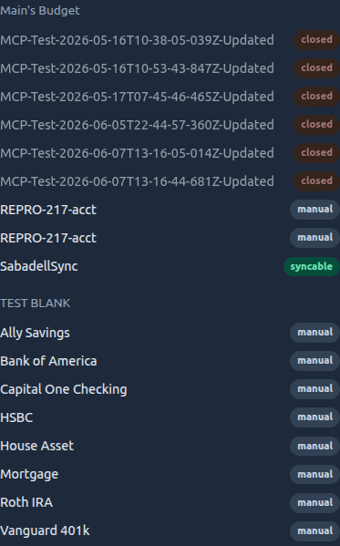

# Web Dashboard

The Actual-sync web dashboard provides comprehensive real-time monitoring, manual sync controls, interactive analytics, and system management through a modern tabbed interface.

## Overview

The dashboard is a responsive single-page application that offers:

- **📊 Overview Tab** - 2-column layout with service health, server status, per-account syncability (syncable / manual / closed badges, with a "Show closed" toggle), recent activity, and live logs
- **�� Analytics Tab** - All-time statistics with interactive charts (success rates, duration trends, timeline)
- **🗂️ History Tab** - Searchable sync history with server/limit filters, a per-sync account breakdown (`N synced · M failed · K skipped`), and detailed error messages
- **⚙️ Settings Tab** - Date format preferences, orphaned server cleanup, and data management
- **🔴 Live Status** - Real-time WebSocket streaming with ring buffer (500 logs, 200 displayed)
- **🔐 Authentication** - Optional basic auth or token-based authentication
- **🎨 Dark Theme** - Modern UI optimized for long monitoring sessions

## Account syncability

The Overview tab lists each server's accounts with a badge so you can tell, at a glance, which accounts actually bank-sync:

- 🟢 **syncable** — bank-linked (`account_sync_source` set) and open; these are the accounts that bank-sync.
- ⚪ **manual** — open but not bank-linked; runs no bank sync.
- 🔴 **closed** — a closed account; hidden by default, revealed with the **Show closed** toggle.

The data is captured during each sync (the same partition the engine uses to decide what to sync, see [ARCHITECTURE.md](ARCHITECTURE.md)) and persisted to SQLite, so the dashboard renders it **without opening a live connection to the Actual server**. It is therefore as fresh as the last sync; a server that has never synced this session shows no accounts yet.

Served at `GET /api/dashboard/accounts` (subject to the dashboard's auth setting), grouped by server.

