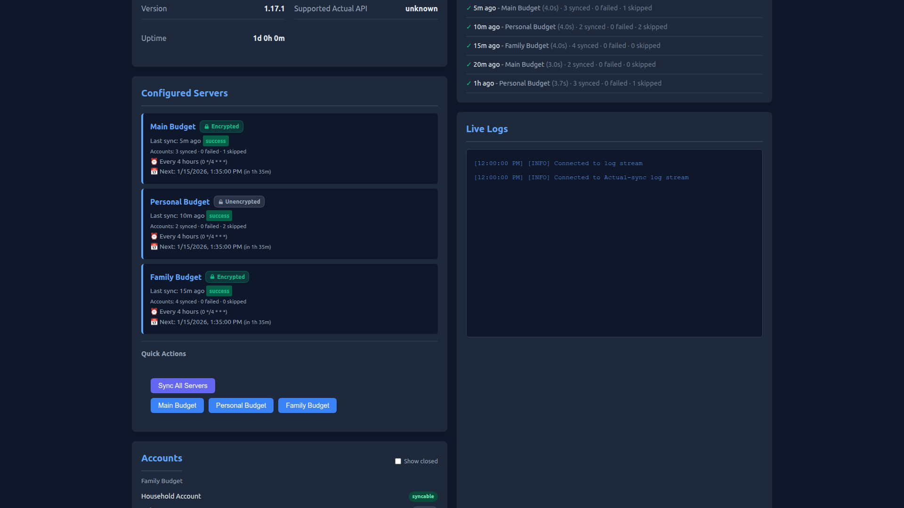

# Web Dashboard

The Actual-sync web dashboard provides comprehensive real-time monitoring, manual sync controls, interactive analytics, and system management through a modern tabbed interface.

## Overview

The dashboard is a responsive single-page application that offers:

- **📊 Overview Tab** - 2-column layout with service health, server status, per-account syncability (syncable / manual / closed badges, with a "Show closed" toggle), recent activity, and live logs
- **�� Analytics Tab** - All-time statistics with interactive charts (success rates, duration trends, timeline)
- **🗂️ History Tab** - Searchable sync history with server/limit filters, a per-sync account breakdown (`N synced · M failed · K skipped`), and detailed error messages
- **⚙️ Settings Tab** - Date format preferences, orphaned server cleanup, and data management
- **🔴 Live Status** - Real-time WebSocket streaming with ring buffer (500 logs, 200 displayed)
- **🔐 Authentication** - Optional basic auth or token-based authentication
- **🎨 Dark Theme** - Modern UI optimized for long monitoring sessions

## Live Logs authentication

The Live Logs panel streams from `/ws/logs`, which is authenticated like the rest of the dashboard. Before each connect the page fetches a single-use, 30 second ticket from `/api/dashboard/ws-ticket` using the same credentials as every other dashboard request, then opens the stream with it. You do not configure anything for this.

If the panel keeps showing "Disconnected from log stream. Reconnecting...", check the service log for `WebSocket handshake refused`:

- **status 401**: the ticket request failed or the ticket expired; reload the page and sign in again.
- **status 403, Origin not allowed**: the page was loaded from an origin that is not the host the browser connects to. Add that origin to `dashboard.allowedOrigins` (see [CONFIG.md](CONFIG.md)).
- **status 429**: more than 10 log streams are open from one address (every browser tab holds one). Behind a reverse proxy all streams share the proxy's address.

## Account syncability

The Overview tab lists each server's accounts with a badge so you can tell, at a glance, which accounts actually bank-sync:

- 🟢 **syncable** — bank-linked (`account_sync_source` set) and open; these are the accounts that bank-sync.
- ⚪ **manual** — open but not bank-linked; runs no bank sync.
- 🔴 **closed** — a closed account; hidden by default, revealed with the **Show closed** toggle.

The data is captured during each sync (the same partition the engine uses to decide what to sync, see [ARCHITECTURE.md](ARCHITECTURE.md)) and persisted to SQLite, so the dashboard renders it **without opening a live connection to the Actual server**. It is therefore as fresh as the last sync; a server that has never synced this session shows no accounts yet.

Served at `GET /api/dashboard/accounts` (subject to the dashboard's auth setting), grouped by server.

## Behind a reverse proxy

If nginx, Traefik or Caddy sits in front of the dashboard, set `healthCheck.trustProxy` (usually `1`, one proxy) so the per-client rate limit and the auth-failure log see the real client IP instead of the proxy's. Keep `dashboard.auth` enabled, and do not also publish the port directly. See [CONFIG.md](CONFIG.md#healthcheck-optional) for the accepted values and [DOCKER_DEPLOYMENT.md](DOCKER_DEPLOYMENT.md#1-security) for an nginx example.
